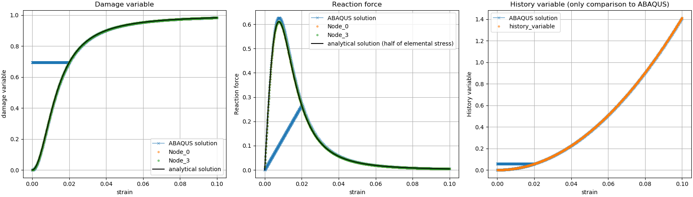
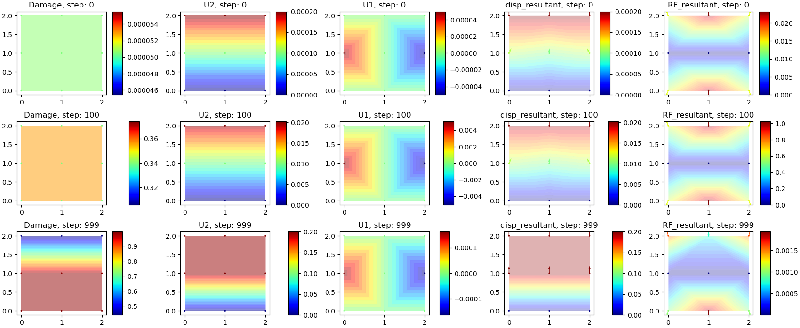
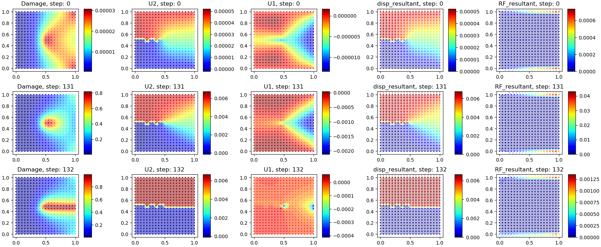

Getting Started
===============

Obtaining Phase-Field_FE
------------------------

Get Phase-Field_FE by cloning it from `gitlab <https://gitlab.ethz.ch>`_::

  > git clone https://gitlab.ethz.ch/npichler/project-tehpc-niels-pichler.git

Requirements for Phase-Field_FE
-------------------------------

The following software are required for TEHPC Niels Pichler:

- `CMake <https://cmake.org/>`_ (3.1.0 or higher)
  
Optional for plotting scripts:

- `Python3 <https://www.python.org/>`_

Compiling Phase-Field_FE
------------------------

**Ubuntu-based and macOS systems**:

You can configure and build Phase-Field_FE by following these steps::

  > cd project-tehpc-niels-pichler
  > mkdir build
  > cd build
  > cmake -DCMAKE_BUILD_TYPE:STRING=Release ..
  > make

If you would like to run the Phase-Field_FE tests as verification::

  > make test

  
Running an example
------------------

Some example simulations are provided in the `project-tehpc-niels-pichler/examples` folder. To run a simulation, you typically proceed as follows::

  > cd examples
  > make
  > .basic_example <sim-name> <input-file-name> <output-directory>
  
To reproduce the resultes presented in [1]_ fig.5 do::
  
  > mkdir output
  > ./basic_example sim_paper input_paper.inp output  
    
You can visualize the results with the provided script::

  >  cd ../python
  >  python3 plotter_paper.py
  
It should produce the following result:

  
A 4 element model under similar boundary conditions is also provided, to run it do::

  > ./basic_example sim_4_el input_4_el.inp output  

To visualize the results, use another provided script::

  > cd ../python
  > python3 plotter_Map.py output sim_4_el 0 500 999

It should produce the following result:

   
From top to bottom the results of each step (0, 333, 666, 999) and from left to right the nodal value of the damage variable, displacement in the y direction, displacement in x direction, the resilting nodal displecement represented by a quived plot and the reaction forces at the boundaries.

A mesher script is provided as well. Without going into the details of its use (see dedicated section in user guide) a last example example can is shown. make sure you are in `build/python` ::

  > python3 mesher.py
  > cp input_20x20_crack_damage.inp ../examples/input_20x20_crack_damage.inp
  > cd ../examples 
  > ./basic_example sim_20x20_crack_damage input_20x20_crack_damage.inp output
  
The code will take some time to run here Nonethless the results can be visualized bfore the simulation reached the final step. Wait until step 135 is completed and in a new termimal do::

  > cd ../python
  > python3 plotter_Map.py output sim_20x20_crack_damage python3 plotter_Map.py output sim_20x20_crack_damage 0 50 131 132
  

Here we see the damage accumulating at the crack tip and propagating through the whole sample between step 131 and 132. The sample is completely broken, the 2 discrete parte are visible from the U2 displacement field.

.. [1] Molnár, Gergely, and Anthony Gravouil. “2D and 3D Abaqus Implementation of a Robust Staggered Phase-Field Solution for Modeling Brittle Fracture.” Finite Elements in Analysis and Design 130 (August 2017): 27–38. https://doi.org/10.1016/j.finel.2017.03.002.
