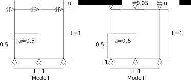

Phase-Field_FE: Brittle fracture in linear elastic material
===========================================================

Keywords
--------
Fracture Mechanics; Non-linear Finite Elements; C++

Author
------

Niels Pichler

Affilitions
-----------

Empa, Swiss Federal Laboratories for Materials Science and Technology
Institute of Structural Engineering, Department of Civil, Environmental and Geomatic Engineering, ETH Zürich

Summary
-------

`Phase-field_FE` provides a basic framework to couple plane strain linear elasticity and phase field fracture mechanics. Namely it models a two dimansional domain with a regular discretization containing a crack that is a spacial discontinuity. Under any type of Dirichlet boundary conditions `Phase-field_FE` can predict the crack path, load evolution in time and displacement fields. 

Statement of Need
-----------------

Fracture mechanics (FM) is a challenging subject in mechanics and has been an active research field since Griffith's analysis of strength [1]_, and has been an answer to the the limits of the material strength approach. The FM approach relies healily on energetic consirerations and has become an established analysis method to predict failure and fracture of materials. 

Some numerical methods to predict failure are mature but sometimes require a predefined knowledge or intuition of the crack propagation path (CZM [2]_), require remeshing (XFEM [3]_) or are limited static analysis (J-integral [4]_, VCCT [5]_). In recent years, formulations of the energetic problem were proposed where the crackes solid is seen as a continuum even across cracked regions [6]_. The method takes advantage of the diffusion of a damage variable coupled with a standard linear elasticity to model arbitrary crack path, the so-called phase-field approach. Since phase field was extended to consider classical FM for instance fatigue [7]_ and elastoplactic FM [8]_. While not included in popular finite element suites like ABAQUS, researchers have taken upon themselves to implement formulations [9]_ and provide in open-source their UELs Fortran code. Notable open-source ressources treating numerical FM include [10]_ and [11]_.

`Phase-field_FE` was developped to handle the basic problem that is damage diffusion coupled with elasticity. It provides a framework to solve the nonlinear problem and is designed such that additional element types, shape and material behavior can be included with no change to the base implementation of the code. 

Evaluation
----------

As a base validation the code is done by comparing to the analytical solution. Given the parameters in [9], i.e. :math:`l_c = 0.1`, :math:`G = 0.05`, :math:`E = 210` and :math:`\nu = 0.3` and 1000 steps the applied displacement is described in the figure below:

.. image:: joss_figures/fig_val_1.svg
   
The analytical solution is given in [9]. 

.. math::

   c_{22} =& E \frac{1-\nu}{(1+\nu) * (1-2\nu)}\\
   d =& \varepsilon² \frac{c_{22}}{G/l_c + \varepsilon² c_{22}}\\
   \sigma_{22} =& 2R_f = c_{22} \varepsilon (1-d)²\\
   
On a single element, we see the implementation recovers the theoric value, the accuraccy is even greater than the ABAQUS UELs proposed in [9]. Further qualitative validation is obtained when the on a bigger domain. In the following, the under pure Mode I and mode II applied as described below: 

**Here text about the Mode I and II results**

Nonetheless the code structure and architecture has some drawbacks that need to addressed as well. A nonlinear solver class was implemented to increase the code modularity and separate the model construction from the solver but the solver class is used only to solve linear systems and the nonlinear aspect is confined to the model class. This is a drawback that should be adress in further developments in order to work safely on optimizing the solver from the model construction. 

Outlook
-------

Further development of the code sould include: 

	* The use of triangular elements that to allow for local refinments and thus faster execution
	* The possibility to include nonlinear elasticity or plastic material behavior would be of great interest
	* Code parallelization
	* Use the current model to investigate the mode mixity at the crack tip in the case of bi-material interface (a challenging problem in FM [12]_)
	* Use the current model to simulate a soft material layered between two stiffer materials to mimic an adhesive layer bonding 2 steel parts

References
----------

.. [1] Griffith Alan Arnold 1921VI. The phenomena of rupture and flow in solids, Philosophical Transactions of the Royal Society of London. Series A, Containing Papers of a Mathematical or Physical Character221163–198 `<http://doi.org/10.1098/rsta.1921.0006>`

.. [2] Ãlvarez, D., B.R.K. Blackman, F.J. Guild, and A.J. Kinloch. Mode I Fracture in Adhesively-Bonded Joints: A Mesh-Size Independent Modelling Approach Using Cohesive Elements. Engineering Fracture Mechanics 115 (January 2014): `<https://doi.org/10.1016/j.engfracmech.2013.10.005>`.

.. [3] Soheil Mohammadi Extended Finite Element Method: for Fracture Analysis of Structures. Blackwell Publishing, 2008 `<10.1002/9780470697795.ch7>`

.. [4] Rice, J. R. A Path Independent Integral and the Approximate Analysis of Strain Concentration by Notches and Cracks. Journal of Applied Mechanics 35, no. 2 (June 1, 1968). `<https://doi.org/10.1115/1.3601206>`.

.. [5] Krueger, Ronald. The Virtual Crack Closure Technique: History, Approach and Applications,n.d., 64.

.. [6] Francfort, G.A., and J.-J. Marigo. Revisiting Brittle Fracture as an Energy Minimization Problem. Journal of the Mechanics and Physics of Solids 46, no. 8 (August 1998): `<https://doi.org/10.1016/S0022-5096(98)00034-9>`.

.. [7] A. Mesgarnejad, A. Imanian, A. Karma. Phase-field models for fatigue crack growth. Theoretical and Applied Fracture Mechanics, 103, 2019 `<https://doi.org/10.1016/j.tafmec.2019.102282>`.

.. [8] Li, Pengfei & Yvonnet, Julien & Combescure, Christelle & Makich, Hamid & Nouari, Mohammed. (2021). Anisotropic elastoplastic phase field fracture modeling of 3D printed materials. Computer Methods in Applied Mechanics and Engineering. 10.1016/j.cma.2021.114086. 

.. [9] Molnár, Gergely, and Anthony Gravouil. “2D and 3D Abaqus Implementation of a Robust Staggered Phase-Field Solution for Modeling Brittle Fracture.” Finite Elements in Analysis and Design 130 (August 2017): 27–38. https://doi.org/10.1016/j.finel.2017.03.002.

.. [10] Jha et al., (2021). NLMech: Implementation of finite difference/meshfree discretization of nonlocal fracture models. Journal of Open Source Software, 6(65), 3020, https://doi.org/10.21105/joss.03020

.. [11] Kaczmarczyk et al., (2020). MoFEM: An open source, parallel finite element library. Journal of Open Source Software, 5(45), 1441, https://doi.org/10.21105/joss.01441

.. [12] Suo, Zhigang, and John W. Hutchinson. Interface Crack between Two Elastic Layers. International Journal of Fracture 43, no. 1 (May 1990): `<https://doi.org/10.1007/BF00018123>`

