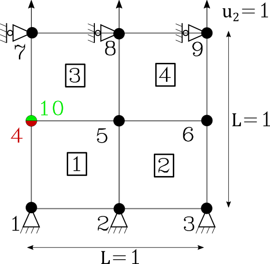

User's Guide
============

Input files
~~~~~~~~~~~

In order to illustrate the input file structure the following input file for the following problem is presented:

The coressponding input file :code:`input_3x3_crack_damage.inp` reads as follows:

.. literalinclude:: ../../examples/input_3x3_crack_damage.inp
   :language: text

A first section defines the general parameters, then follows the nodes, elements and Dirichlet boundary conditions. Each line starts with `$` to signify to the parser that an element is declared here. 

Python mesher tool
~~~~~~~~~~~~~~~~~~

In order to efficiently write larger input files a python script is provided for assisstance:

.. literalinclude:: ../../python/mesher.py
   :language: python

Only the first lines (until BC definition) are relevant to use the script and the explanations are given in the comments. The parameters can be freely chosen. Note a general rule of thumb, `lc` must be at least twice the smallest element size. 

This script will make a rectangular domaim of length `lx`, height `ly` divided in  `x_disc` and `y_disc` parts. The lower left corner stands in at the origin. A crack can be defined, the element in the `crack` list are the coordinates of the the crack start and end, it should overlap with nodes. These nodes will be duplicated.

The elastic properties are defined as the same for all elements but can be set for each element. Finally the Dirichlet boundary conditions are set as follows, each side of the domain can be assigned a displacement in a specific direction.
